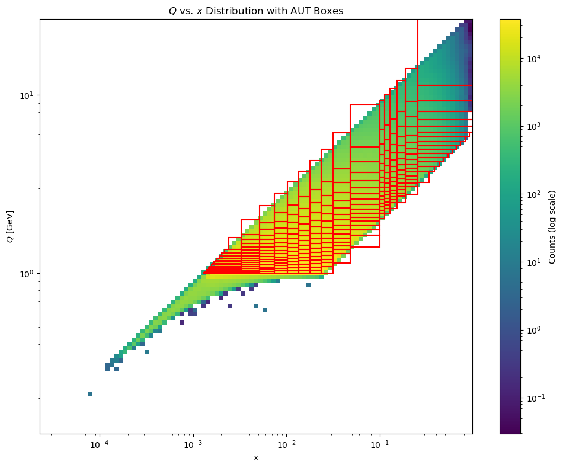

# tmd-eic-ana
[](https://github.com/Gregtom3/tmd-eic-ana/actions/workflows/ci.yml)

This repository manages multi-dimensional injection studies related to single-hadron $A_{UT}$ observables at the future Electron Ion Collider. 

The general idea is to connect ROOT TTree's containing Monte Carlo simulated SIDIS events at the EIC to projected asymmetries & uncertainties in bins of $X,Q,Z,PhPerp$. Critical to the project's functionality is the format of the ROOT TFile and its contents. The program `macro/generate_pseudodata.cpp` can be used as a reference for the desired structure. The ROOT TFile and TTree outputted by the project's code is consistent with the output of the [SidisTree.cxx](https://github.com/eic/epic-analysis/blob/main/src/SidisTree.cxx) in the [epic-analysis](https://github.com/eic/epic-analysis) repository. 

Several ingredients beyond the kinematics outputted by the Monte Carlo simulation are required to project future uncertainties. First, a list of tables in $X,Q,Z,PhPerp$ are provided in `tables/` with their sqrt(s) specifying the $5\times41$, $10\times100$ and $18\times275$ configuration. A default $0\times0$ table is provided for testing.

From the provided tables, here are the $(X,Q)$ binning for the 3 different energy configurations. 



*Binning for the 5x41 energy configuration.*


*Binning for the 10x100 energy configuration.*


*Binning for the 18x275 energy configuration.*

> ⚠️ **NOTE:** The *5x41* binning scheme seems to cover very little of the EIC phase space. We are still determining if this is a bug.


Additionally, the expected experimental integrated luminosity for each of the energy configurations is defined in `include/Constants.h`. The Monte Carlo simulation's TFile's provide a total number of generated events and total cross section, which is pulled by `include/Utility.h` to determine an effective Monte Carlo simulated integrated luminosity. A scale factor is defined to weigh the Monte Carlo events to the yields expected at the EIC. This, combined with the $Q^2$ dependent weight attributed to each event, folds into plotting codes and injection codes.


## Repository Structure
- `bin/`: Compiled binaries for tasks such as pseudodata generation, injection, and plotting.

- `include/`: Header files defining the core classes and utilities used in the project.

- `macro/`: Source files for macros that are compiled into binaries in the `bin/` directory.

- `slurm/`: SLURM job scripts for running tasks on a cluster.

- `src/`: Source files implementing the core functionality of the project.

- `tables/`: Data tables used in the analysis.

- `tests/`: Unit tests for validating the functionality of the project.

- `submit_injection_jobs.rb`: Script for submitting injection jobs.

---

## Installation Guide
1. Install `yaml-cpp` locally:
   ```bash
   git clone https://github.com/jbeder/yaml-cpp.git
   cd yaml-cpp
   mkdir build && cd build
   cmake .. -DCMAKE_INSTALL_PREFIX=$HOME/.local -DYAML_BUILD_SHARED_LIBS=ON
   make
   make install
   ```
   Update your `LD_LIBRARY_PATH`:
   ```bash
   export LD_LIBRARY_PATH=$HOME/.local/lib64:$LD_LIBRARY_PATH
   ```

2. Build the project:
   ```bash
   make
   ```

---

## Usage
After running `make`, the binaries for the project will be located in the `bin/` directory. For immediate testing of the repository's functionality, consider generating pseudodata which is compatible with the remaining binaries. After all, the plotting/injection code requires a ROOT TFile and ROOT TTree of Monte Carlo SIDIS events.
### Generating Pseudodata
```bash
./bin/generate_pseudodata --file input.root --tree myTree --energy 10x100
```
This will create a ROOT TFile at `out/output.root` from which the remaining binaries can hook into. The continuous integration pipeline handled through the GitHub Actions also generates this fake data. Inside the ROOT TFile are the following contents.

- A ROOT TTree titled `tree` containing the following branches (most are pulled from a uniform distribution):
  - `X` (`Double_t`)
  - `Q2` (`Double_t`)
  - `Z` (`Double_t`)
  - `PhPerp` (`Double_t`)
  - `PhiH` (`Double_t`)
  - `PhiS` (`Double_t`)
  - `Y` (`Double_t`)
  - `TrueX` (`Double_t`)
  - `TrueQ2` (`Double_t`)
  - `TrueZ` (`Double_t`)
  - `TruePhPerp` (`Double_t`)
  - `TruePhiH` (`Double_t`)
  - `TruePhiS` (`Double_t`)
  - `TrueY` (`Double_t`)
  - `Weight` (`Double_t`)
  - `Spin_idx` (`Int_t`)
- A `vector<int>` titled `TotalEvents` with a single entry. This corresponds to the total number of Monte Carlo simulated events (whether or not they are accepted by the detector system).
- A `vector<double>` titled `XsTotal` with a single entry. This corresponds to the total cross section of the Monte Carlo simulation in `pb` (default for PYTHIA).

### Injecting Data
Use the `inject` binary to inject pseudodata into the analysis:
```bash
./bin/inject --file out/output.root --tree tree --energy 10x100 --grid "X,Q"
```
Some useful options include...

- `--maxEntries`
- `--bin_index_start` 
- `--bin_index_end`
- `--n_injections` 

### Creating 1D Plots
Run the `make_1d_plots` binary to generate 1D plots:
```bash
./bin/make_1d_plots --file out/output.root --tree tree --energy 10x100 --maxEntries 10000
```

### Creating 2D X-Q Plots
Run the `make_2d_X_Q_plots` binary to generate 2D X-Q plots:
```bash
./bin/make_2d_X_Q_plots --file out/output.root --tree tree --energy 10x100 --maxEntries 10000
```

### Batch submission with `submit_injection_jobs.rb`
- Purpose: create SLURM job scripts that run the `inject` binary across ranges of table bins and optionally submit them to the cluster.
- How it works (brief):
  - Reads a table file corresponding to the chosen `--energy` to determine unique bins for the requested grid (mapping: `5x41`, `10x100`, `18x275` to files in `tables/`).
  - Validates the `--grid` values (allowed: `X`, `Q`, `Z`, `PhPerp`).
  - Infers an expected ROOT file path for the given energy and checks that the file exists before creating job scripts.
  - Writes SLURM scripts into a timestamped subdirectory under `slurm/` (includes energy, injection count, bins info, and sanitized grid in the directory name).
  - Each SLURM script runs `./bin/inject` with the requested options and writes a YAML output per job.
  - Prompts the user to submit the created jobs interactively; if confirmed, scripts are submitted with `sbatch`.
- Required options (examples):
  - `--energy 10x100 --n_injections 10 --bins 100 --bins_per_job 10 --grid X,Q`
- Notes:
  - If `--bins` is <= 0, the script will use all unique bins found in the table.
  - If `--maxEntries` is provided and > 0, it will be passed through to the `inject` command in each job script.
  - The script exits with an error if the inferred ROOT file is missing or if table columns are malformed.


## Output Format

From the `./bin/inject` script we generate `.yaml` files summarizing (potentially multiple) injections. Here is a sample look at the output...

```
jobs:
  - bin_index: 0
    events: 78
    expected_events: 78
    X_min: 0
    X_max: 0.125
    Q_min: 1
    Q_max: 2.125
    Z_min: 0
    Z_max: 1
    PhPerp_min: 0
    PhPerp_max: 5
    used_reconstructed_kinematics: true
    n_injections: 1
    injected: 0
    all_extracted: [-0.3886772893171366]
    all_errors: [0.1708567543254759]
    mean_extracted: -0.3886772893171366
    stddev_extracted: 0
  - bin_index: 1
    events: 126
    expected_events: 126
    X_min: 0
    X_max: 0.125
    Q_min: 2.125
    Q_max: 3.25
    Z_min: 0
    Z_max: 1
    PhPerp_min: 0
    PhPerp_max: 5
    used_reconstructed_kinematics: true
    n_injections: 1
    injected: 0
    all_extracted: [-0.1493078905389746]
    all_errors: [0.1587550516849648]
    mean_extracted: -0.1493078905389746
    stddev_extracted: 0
```

For each `job`, we specify the following fields...

- `bin_index`: The index of the bin in the grid being injected/analyzed.
- `events`: The number of Monte Carlo events found in this bin.
- `expected_events`: The scaled number of events expected at the EIC for this bin.
- `X_min`, `X_max`, `Q_min`, `Q_max`, `Z_min`, `Z_max`, `PhPerp_min`, `PhPerp_max`: The kinematic boundaries of the bin.
- `used_reconstructed_kinematics`: Boolean indicating if reconstructed kinematics were used (vs. true kinematics).
- `n_injections`: Number of independent injections performed for this bin.
- `injected`: If non-zero, sepcifies the artificial value of injected $A_{UT}$ for that bin. Otherwise, this value is determined by reading from `tables/`.
- `all_extracted`: List of extracted asymmetry values for each injection.
- `all_errors`: List of statistical errors for each injection.
- `mean_extracted`: Mean of the extracted asymmetry values.
- `stddev_extracted`: Standard deviation of the extracted asymmetry values.

The $\mathrm{mean_extracted}\pm\mathrm{stddev_extracted}/\sqrt{n_injections}$ gives us an idea as to the precision with which the injection procedure can reproduce the underlying asymmetry in that bin, i.e. the statistical uncertainty on the average extracted value across repeated pseudo-experiments. In practice, to project EIC uncertainties, one should use the mean of the `all_errors`. These are scaled to experimental luminosities in the following way ...

$$
\sigma_{\mathrm{exp}}=\sigma_{\mathrm{MC}}\sqrt{\frac{N_{\mathrm{MC}}}{N_{\mathrm{exp}}}}
$$

... where ...

$$
N_{\mathrm{MC}}=\frac{(\sum w_i)^2}{\sum w_i^2}
$$

$$
w_i = Q2\mathrm{weight}_i
$$

... and ...

$$
N_{\mathrm{exp}} = \frac{\mathcal{L}_{\mathrm{exp}}}{\mathcal{L}_{\mathrm{MC}}}\sum w_i
$$

... where the $Q2\mathrm{weight}_i$ is a floating point number defined in `epic-analysis` which captures how the epic campaign's Monte Carlo is generated in million-event-batches of different $Q^2$ ranges. For instance, one can expect the epic campaign simulated an equal number of $Q^2\in[1,10] GeV^2$ data as $Q^2\in[10,100] GeV^2$ data. To account for this, both receive a tuned $Q^2$ weight per event to scale the data, so that merged datasets do not have jagged edges.


